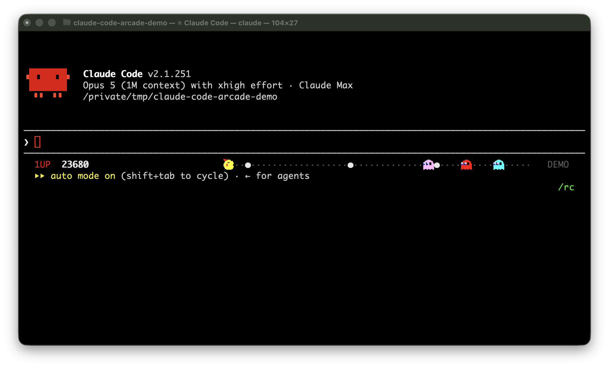

# Claude Code Arcade

**Vibe code with an 80s arcade vibe.**

An arcade running in your Claude Code status line, animated by whatever Claude
is doing. It works, the arcade plays.

Ms. Pac-Man. Frogger. Or an aquarium and a safari, if you want something calmer.
They play themselves — grab the joystick if you want, but you don't have to.

Or WOPR, from WarGames, which types its way through the film while Claude works:
the logon, the list of games, and a game of Global Thermonuclear War.



## Setup

Paste this into Claude Code (the `!` runs it as a shell command) or into any
terminal without the `!`:

```
!git clone https://github.com/jystervinou/claude-code-arcade.git ~/.claude-code-arcade && bash ~/.claude-code-arcade/install.sh
```

Then **fully quit your terminal app (⌘Q) and reopen it** — terminals cache
glyph lookups per process, so a new tab won't pick the sprite font up.

Needs Node (any recent version) and macOS or Linux. Nothing system-wide, no
sudo: it writes `~/.arcade/`, `~/.local/bin/arcade`, one font file in your user
font dir, and the `statusLine` key in `~/.claude/settings.json` — backing up
whatever was there. [Undo it all](#uninstalling) with one command.

It checks all of those first and stops to ask if anything already there isn't
its own — an existing `~/.arcade`, another `arcade` on your PATH, a statusline
you're already using.

## Playing

```
arcade theme mspacman   Ms. Pac-Man
arcade theme frogger    Frogger
arcade theme wopr       W.O.P.R., typing its way through WarGames
arcade theme aquarium   🐟🐠🐡🦐🦀🦞🪼 / 🦈🐋🐳🐬🐙🦑🐢🦭🐊
arcade theme safari     🐒🦩🐍🦌🦂🦡🦅 / 🐘🦒🦏🦛🐆🦓🐃🦍🐊🐪
arcade demo on          keep playing while Claude is idle
arcade play             joystick (optional)
arcade off              switch the arcade off; arcade on switches it back
arcade status           what's running
```

Those are ordinary shell commands. Run them in any terminal, or straight from
the Claude Code prompt with a `!` in front — `!arcade theme frogger` runs it in
your session's shell without leaving Claude Code. The one exception is
`arcade play`, which takes the keyboard over and so wants a spare terminal pane
of its own.

Switch any time — it takes effect live.

She plays herself: laps the maze, eats the dots, runs from ghosts, doubles back
for fruit. Real arcade scoring, kept between sessions, one score per game.

## Switching it off

```
arcade off
```

Stops the daemon and blanks the status line, without uninstalling anything:
your theme, your scores and the font all stay where they are, and nothing runs
in the background until you say so.

```
arcade on
```

Brings it back within a second — the status line starts the daemon again on its
next refresh. `arcade status` says which way the switch is set.

## Taking the joystick (optional, and fiddly)

Ms. Pac-Man and Frogger can be steered. The catch is that Claude Code owns
every keystroke in its own window, so there are two ways in — neither is
seamless, and the games are perfectly happy without you:

```
arcade play          # in a SPARE terminal pane: ←/→ steer, ↑ boost
arcade play global   # F1 ←, F2 →, F3 boost from any window (macOS)
```

`global` needs a one-time Accessibility grant. If your F-row does brightness
and volume — Apple's default — those keys aren't F1/F2/F3 at all, so press
fn+F1/F2/F3, or turn on "Use F1, F2, etc. keys as standard function keys".
It watches exactly those three keys, can't swallow them, and sends nothing
anywhere. Either way she goes back to playing herself ~30s after you stop.

## The sprite font

The installer sets this up for you; `arcade font remove` drops back to Unicode
glyphs, and `mspacman` plays fine either way.

The sprites are an original pixel font, and the trick is *where* they live:
U+1CC10–1CC16, in Unicode 16's
"Symbols for Legacy Computing Supplement" block (fittingly), which no font
shipped with macOS covers. When the terminal's font has no glyph for a real
codepoint, CoreText searches every installed font — and finds ours. (The
same hijack via Private Use Area codepoints does *not* work: macOS
deliberately skips PUA in automatic fallback. And overriding Apple Color
Emoji with a patched copy in `~/Library/Fonts` — the macmoji approach — is
dead on macOS 26: the system copy always wins the name conflict.)

Each glyph is drawn one square per pixel on a 16×16 grid, with color layers
baked in — her bow is genuinely red, not tinted.

Works on macOS and Linux. On Windows Terminal, stick to `mspacman` or `wopr`,
neither of which needs a font at all.

## How it works

A small daemon watches your sessions and writes one frame every 200ms;
`statusline.sh` just prints the current one. All your open Claude Code windows
share the same world, and the daemon shuts itself down two minutes after the
last one closes — or the moment you run `arcade off`.

## Settings

The installer sets this for you:

```json
"statusLine": {
  "type": "command",
  "command": "~/.arcade/statusline.sh",
  "padding": 0,
  "refreshInterval": 1
}
```

## Uninstalling

```
bash ~/.claude-code-arcade/uninstall.sh
```

Puts your old statusline back, removes the CLI and the font, keeps your scores
(add `--purge` to drop those too). Then restart your terminal.

## Not affiliated

An independent hobby project, released under the MIT licence. Not affiliated
with, endorsed by, or sponsored by Anthropic; "Claude" and "Claude Code" are
Anthropic's trademarks, used here only to say what this plugs into.

The games it imitates belong to other people too — Ms. Pac-Man and Frogger to
their respective rights holders, WarGames to its own — and nothing here is
affiliated with any of them either. No original assets are used: the sprites
are drawn from scratch and the WOPR screens are typed out as homage.
